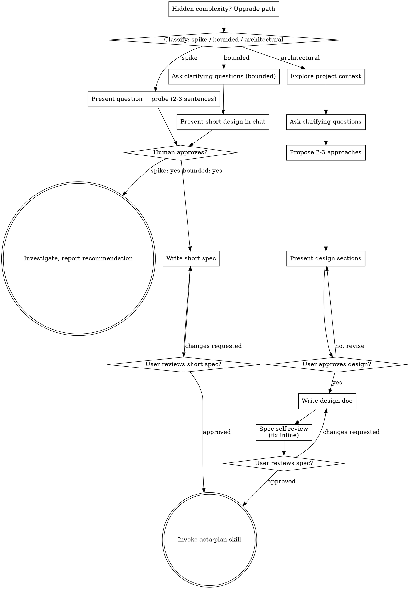

# Brainstorming Ideas Into Designs

Help turn ideas into fully formed designs and specs through natural collaborative dialogue.

Start by classifying how much process the request needs, then work
through your path: understand the context, refine the idea, present a
design, and get your human partner's approval.

<HARD-GATE>
Do NOT invoke any implementation skill, write any code, scaffold any
project, or take any implementation action until you have told your
human partner what you intend and they have approved it. This applies
to EVERY task on EVERY path below — the ceremony scales with the task;
the approval gate never does.
</HARD-GATE>

## Three Paths

Before your first question, classify the request and say the
classification out loud — "this looks bounded, so I'll present one
design in chat and then write a short spec" — so your human partner
can override it:

- **Spike** — a feasibility question ("can we...", "is it possible...",
  "quick and dirty is fine") whose output is an answer, not code you
  keep. Present the question and what you'll try in 2-3 sentences, get
  a nod, then find out as cheaply as correctness allows. No design
  doc, no spec file. Report findings as a recommendation; anything you
  built stays labeled throwaway.
- **Bounded** — a well-scoped change to code that already exists in
  this repo: a new flag, a small endpoint, a one-file fix.
  Understanding the kind of app is not enough — bounded means the flow
  you are changing is already here to read. If there is no existing
  flow to change, the task is not bounded. Ask the clarifying
  questions that matter, present ONE recommended design in chat (a
  few sentences to a few short paragraphs), and STOP. Implementation
  starts only after your human partner says yes to that design — a
  bounded task's approval is as hard a gate as an architectural one.
  On that yes, write a short spec (about half a page) to
  `.acta/specs/YYYY-MM-DD-<topic>-design.md`, run
  `acta id`, commit, ask the user to review the file, and on
  approval invoke the acta:plan skill. No 2-3 approaches, no
  per-section approval, no one-per-session limit.
- **Architectural** — new projects, new subsystems, changes that
  restructure how components fit together or alter interfaces others
  depend on. Follow the full process: questions, approaches, sectioned
  design, written spec, then the acta:plan skill.

When in doubt between two paths, take the heavier one. The ratchet is
one-way: hidden complexity discovered mid-task upgrades the path —
stop, say so, and step up. Nothing downgrades mid-task.

**Sensitive changes take the heavier path.** A change that touches a trust boundary, auth, money, or a data migration gets a written spec in `.acta/specs/` even when it is Bounded.

## Architectural path: scratch item and one per session

These rules are for the Architectural path only. Spike and Bounded need
no scratch item and are free in number.

**Step 0: scratch item.** Find the scratch item the request names. If
there is none, file the user's words with `acta scratch new` and then
run `acta set scratch/<stem> status brainstorming`. The brainstorm hangs
off that item, so a dead session loses nothing.

Append as you go. Every answer the user gives and every approved design
section is appended as it happens with `acta scratch add SCR-0001 --section log`.

**One Architectural brainstorm per session.** When a second one comes up
in the same session, file it as a scratch item and ask the user to pick
one of:

- (a) **Background agent** — run `claude --bg 'brainstorm SCR-0001'`
  from the repo, then tell the user to open the agents view (press ←, or
  `claude agents`).
- (b) **New herdr tab** — offer this only when the session text has the `herdr:` line; the acta hook adds it only inside herdr. With no such line, do not mention herdr.
- (c) **Manual new session** — copy the prompt `brainstorm SCR-0001` to
  the clipboard (`pbcopy` on macOS, `wl-copy` or `xclip` on Linux, OSC 52
  when none of those work) and also print the prompt, so the user can
  type it when the clipboard failed.

Plan, build, review and land for this brainstorm may continue in the
same session. Only the brainstorm itself is one per session.

**Subagent models.** Only when `acta config show` lists `subagent_models: split` and you run in Claude Code: subagents that write code use `model: "sonnet"`; all other subagents (mapping, explore, planning help, debug investigation, spikes) use `model: "opus"`; reviewers use your own model alias. Otherwise name no model and follow the user's own config.

## Anti-Pattern: "Too Simple To Need Approval"

Every path ends with your human partner approving your intent before
implementation. A todo list, a single-function utility, a config
change — the design may be two sentences in chat, but you MUST present
it and get approval. "Simple" tasks are where unexamined assumptions
cause the most wasted work. What scales with simplicity is the
artifact, never the approval.

## Red Flags

| Thought | Reality |
|---------|---------|
| "This is too simple to need a design" | Simple means a short design, not no design. Two sentences in chat, then approval. |
| "I'll call it bounded and skip the spec" | Reaching for a label to skip work IS the doubt — take the heavier path. |
| "It's bounded and the design is obvious — I'll start while they read it" | The gate is the approval, not the design's length. Present, then stop until you hear yes. |
| "I understand this kind of app, so it's bounded" | Bounded measures the repo, not your familiarity. A new project has no existing flow — it is architectural. |
| "The spike works, so I'll keep the code" | A spike's output is an answer. Keeping the code is a new request — classify it. |
| "It grew, but I'm almost done — no need to re-classify" | Hidden complexity upgrades the path mid-task. Stop and say so. |
| "They approved the spike, so the follow-up change is approved too" | Each task gets its own classification and its own approval. |

## Checklist

Classify first, announce the path, then create a task for each item on
your path and complete them in order.

**Spike:**
1. **Explore project context** — enough to frame the probe
2. **Present question + probe plan** — 2-3 sentences
3. **Get approval** — a nod is enough
4. **Investigate** — as cheaply as correctness allows
5. **Report findings** — a recommendation; label anything built as throwaway

**Bounded:**
1. **Explore project context** — check files, docs, recent commits
2. **Ask clarifying questions** — one at a time, the ones that matter
3. **Present short design in chat** — approach, files touched, testing
4. **Get approval** — STOP and wait for an explicit yes; presenting the design and starting in the same breath is skipping the gate
5. **Write short spec** — about half a page in `.acta/specs/`, run `acta id`, commit on main
6. **User reviews spec** — ask them to read the file, then wait for the yes
7. **Transition to implementation** — invoke acta:plan skill

**Architectural:**
0. **Scratch item** — find the item the request names, or file it with `acta scratch new`, then `acta set scratch/<stem> status brainstorming`
1. **Explore project context** — check files, docs, recent commits
2. **Ask clarifying questions** — one at a time, understand purpose/constraints/success criteria; append each answer with `acta scratch add SCRATCH-n --section log`
3. **Propose 2-3 approaches** — with trade-offs and your recommendation
4. **Present design** — in sections scaled to their complexity, get user approval after each section, append each approved section with `acta scratch add SCR-0001 --section log`
5. **Write design doc** — save to `.acta/specs/YYYY-MM-DD-<topic>-design.md`, run `acta id` right after so the spec gets its SPC number and hash, and commit
6. **Spec self-review** — quick inline check for placeholders, contradictions, ambiguity, scope (see below)
7. **User reviews written spec** — ask user to review the spec file before proceeding
8. **Transition to implementation** — invoke acta:plan skill to create implementation plan

## Process Flow

**Terminal states are path-bound.** Architectural: the ONLY skill you
invoke after brainstorming is acta:plan — never frontend-design,
mcp-builder, or any other implementation skill. Bounded: the same
terminal state, acta:plan, once the user has approved the short spec.
Spike: the terminal state is a reported recommendation.

## The Process

The subsections below serve the bounded and architectural paths (a
spike stops at "present the probe, get a nod"). Sections from
**Exploring approaches** onward are architectural-path depth — for
bounded work, context plus a few questions plus one design in chat
plus a short spec is the whole process.

**Understanding the idea:**

- Check out the current project state first (files, docs, recent commits)
- Before asking detailed questions, assess scope: if the request describes multiple independent subsystems (e.g., "build a platform with chat, file storage, billing, and analytics"), flag this immediately. Don't spend questions refining details of a project that needs to be decomposed first.
- If the project is too large for a single spec, help the user decompose into sub-projects: what are the independent pieces, how do they relate, what order should they be built? Then brainstorm the first sub-project through the normal design flow. Each sub-project gets its own spec → plan → implementation cycle.
- For appropriately-scoped projects, ask questions one at a time to refine the idea
- Prefer multiple choice questions when possible, but open-ended is fine too
- Only one question per message - if a topic needs more exploration, break it into multiple questions
- Focus on understanding: purpose, constraints, success criteria

**Exploring approaches:**

- Propose 2-3 different approaches with trade-offs
- Present options conversationally with your recommendation and reasoning
- Lead with your recommended option and explain why
- YAGNI ruthlessly - remove unnecessary features from every approach and design

**Presenting the design:**

- Once you believe you understand what you're building, present the design
- Scale each section to its complexity: a few sentences if straightforward, up to 200-300 words if nuanced
- Ask after each section whether it looks right so far
- Cover: architecture, components, data flow, error handling, testing
- Be ready to go back and clarify if something doesn't make sense

**Design for isolation and clarity:**

- Break the system into smaller units that each have one clear purpose, communicate through well-defined interfaces, and can be understood and tested independently
- For each unit, you should be able to answer: what does it do, how do you use it, and what does it depend on?
- Can someone understand what a unit does without reading its internals? Can you change the internals without breaking consumers? If not, the boundaries need work.
- Smaller, well-bounded units are also easier for you to work with - you reason better about code you can hold in context at once, and your edits are more reliable when files are focused. When a file grows large, that's often a signal it holds more than one job.

**Working in existing codebases:**

- Explore the current structure before proposing changes. Follow existing patterns.
- Where existing code has problems that affect the work (e.g., a file that's grown too large, unclear boundaries, tangled responsibilities), include targeted improvements as part of the design - the way a good developer improves code they're working in.
- Don't propose unrelated refactoring. Stay focused on what serves the current goal.

## After the Design (architectural path)

**Documentation:**

- Write the validated design (spec) to `.acta/specs/YYYY-MM-DD-<topic>-design.md`
  - (User preferences for spec location override this default)
- Write plainly and briefly; short words, short sentences
- Commit the design document to git

**Where files go.** `.acta/` is the default root; `.acta.yaml`, the `ACTA_ROOT` variable or `acta --root` can move it. `acta list --json` shows the specs and plans that already exist. Write the spec and commit it on the branch that is checked out (usually main). No worktree yet: `acta:build` makes the worktree once the plan is approved.

**Debt items.** A plan that works a debt item sets `parent: debt/<stem>` and lists every DBT id it closes in `closes:`.

**Scratch items.** A spec made from one scratch item sets `parent: scratch/<stem>` in its frontmatter. A spec made from several sets the first one as `parent:` and lists the rest in `closes:`, so no item is left dangling. `specced` then follows from either the parent link or the `closes:` list.

**Shared language.** While refining the design, keep `CONTEXT.md` (one domain term per line, in English) and `docs/adr/` (one file per hard-to-explain decision: the decision, why, the alternatives rejected) up to date. Propose a new `CONTEXT.md` term to the user and wait for a yes. These files change only during brainstorming.

**Spec Self-Review:**
After writing the spec document, look at it with fresh eyes:

1. **Placeholder scan:** Any "TBD", "TODO", incomplete sections, or vague requirements? Fix them.
2. **Internal consistency:** Do any sections contradict each other? Does the architecture match the feature descriptions?
3. **Scope check:** Is this focused enough for a single implementation plan, or does it need decomposition?
4. **Ambiguity check:** Could any requirement be interpreted two different ways? If so, pick one and make it explicit.

Fix any issues inline. No need to re-review — just fix and move on.

**User Review Gate:**
After the spec review loop passes, ask the user to review the written spec before proceeding:

> "Spec written and committed to `<path>`. Please review it and let me know if you want to make any changes before we start writing out the implementation plan."

Wait for the user's response. If they request changes, make them and re-run the spec review loop. Only proceed once the user approves.

**Implementation:**

- Approval of the design does not approve the plan; each gets its own yes.
- Invoke the acta:plan skill to create a detailed implementation plan
- Do NOT invoke any other skill. acta:plan is the next step.

